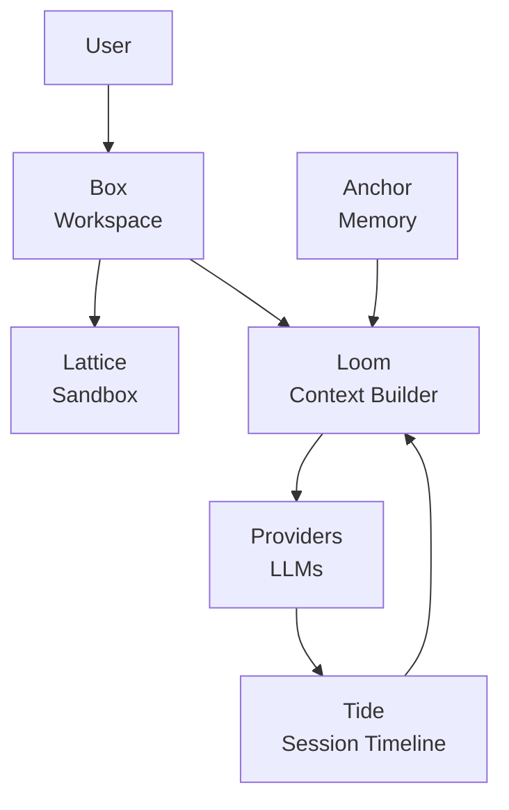
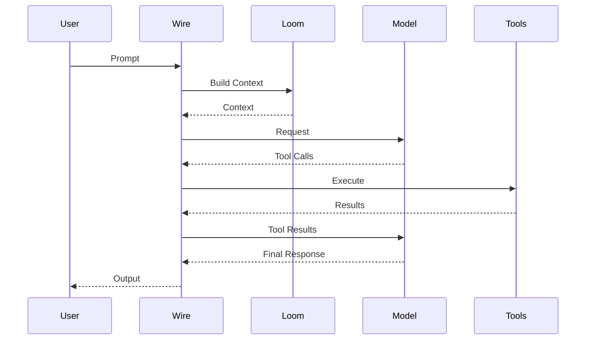
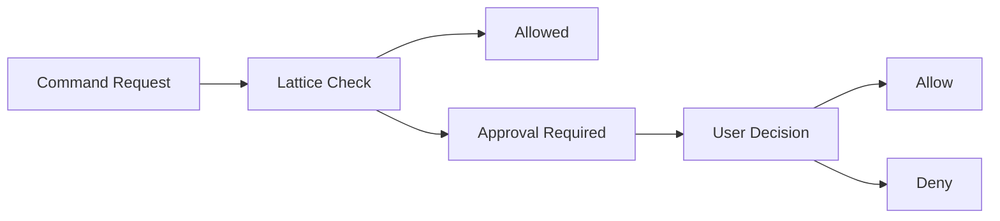
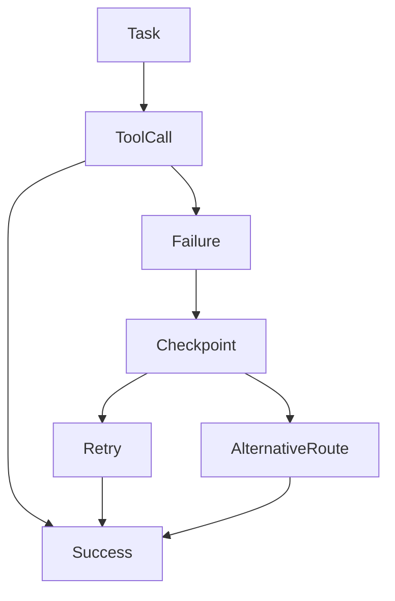

# Wire CLI

Wire CLI é um agente de desenvolvimento **local-first** projetado para execução segura de tarefas, automação de workflows, análise de código e gerenciamento de contexto de longo prazo.

A arquitetura combina memória persistente, sandboxing, auditoria, recuperação automática de falhas e suporte a múltiplos provedores de IA em uma única interface de terminal.

---

# Instalação

## NPM

```bash
npm install -g @brennoleondesouza/wirecli@latest
```

Inicie o Wire:

```bash
wirecli
```

O pacote NPM atua como launcher e baixa automaticamente o binário compatível com o sistema operacional e arquitetura do usuário.

Não é necessário instalar Rust ou Cargo para utilizar versões publicadas.

O nome global do comando é sempre `wirecli`.

---

# Conceitos Arquiteturais

O runtime do Wire é dividido em componentes independentes.



## Box

O Box representa o workspace ativo.

Todas as operações de arquivos, ferramentas e modificações acontecem dentro dele.

---

## Lattice

Lattice é a camada responsável por isolamento e execução segura.

Dependendo da plataforma, ela utiliza:

* Bubblewrap
* Namespaces Linux
* Limites de CPU
* Limites de memória
* Home isolado
* Rede restrita
* `/tmp` privado

Caso o sandbox não possa ser criado corretamente, o Wire falha de forma explícita ao invés de executar comandos diretamente no host.

---

## Anchor

Anchor é o subsistema de memória persistente.

Armazena:

* Preferências duráveis
* Conhecimento de projeto
* Memórias explícitas
* Metadados contextuais

Implementado utilizando SQLite através de `rusqlite`.

---

## Tide

Tide mantém o histórico completo de execução.

Inclui:

* Mensagens
* Tool calls
* Eventos
* Checkpoints
* Resultados de validação
* Aprovações

---

## Loom

Loom é responsável por construir o contexto enviado aos modelos.

Ele combina:

* Estado atual da sessão
* Memórias relevantes
* Arquivos do projeto
* Regras
* Skills
* MCP Context

---

# Fluxo de Execução



---

# Armazenamento Local

Por padrão, os dados ficam em:

```text
~/.wirecli/
```

Estrutura:

```text
~/.wirecli/
├── config/
│   ├── config.toml
│   ├── config.md
│   └── secret.key
│
├── data/
│   ├── history.sqlite3
│   ├── anchor.sqlite3
│   ├── memory_context.json
│   ├── approvals.json
│   ├── approval_audit.jsonl
│   └── harness/
│
├── skills/
├── boxes/
└── hooks.json
```

---

# Provedores de IA

O Wire suporta múltiplos backends.

## OpenRouter

Provider padrão.

```bash
wirecli login
```

Autenticação via PKCE.

---

## API Keys

| Provider  | Variável          |
| --------- | ----------------- |
| OpenAI    | OPENAI_API_KEY    |
| Anthropic | ANTHROPIC_API_KEY |
| Gemini    | GEMINI_API_KEY    |
| DeepSeek  | DEEPSEEK_API_KEY  |
| Mistral   | MISTRAL_API_KEY   |
| Qwen      | DASHSCOPE_API_KEY |
| xAI       | XAI_API_KEY       |
| ZAI / GLM | ZAI_API_KEY       |

---

# Configuração de Provider Customizado

```toml
model_provider = "local-router"
model = "router-smart"

[model_provider.local-router]
name = "Local Router"
base-url = "http://localhost:3000/v1"
method = "responses"
env_key = "LOCAL_ROUTER_API_KEY"

models = [
  "router-fast",
  "router-smart",
  "router-coder"
]
```

---

# Sistema de Aprovações

Wire utiliza aprovação explícita para operações potencialmente perigosas.



Comandos que normalmente exigem aprovação:

* Acesso à rede
* Shells interativos
* Alterações de permissões
* Listeners persistentes
* Execuções fora do Box

---

# Harness

Harness fornece uma camada auditável sobre o loop do agente.

## Executar

```bash
wirecli harness run \
  --prompt "Refactor this project"
```

## Replay

```bash
wirecli harness replay latest
```

## Inspecionar

```bash
wirecli harness inspect latest
```

## Diagnóstico

```bash
wirecli harness doctor
```

---

# Verificação Automática

Após modificações de arquivos, o Wire executa validações automaticamente.

Exemplos:

```text
cargo fmt --check
cargo test

npm run lint
npm run test
npm run build

go test ./...

python -m pytest
```

Os resultados são armazenados como parte da timeline da sessão.

---

# Recuperação de Falhas

O runtime mantém checkpoints para:

* Requests
* Tool Calls
* Streams
* Resultados de validação
* Erros de provider



Isso permite continuar tarefas sem reiniciar o contexto completo.

---

# Subagentes

Wire inclui subagentes especializados.

| Subagent            | Função                 |
| ------------------- | ---------------------- |
| planner             | Planejamento           |
| codebase_researcher | Pesquisa de código     |
| patcher             | Sugestão de alterações |
| reviewer            | Revisão                |
| test_runner         | Execução de testes     |
| security_auditor    | Auditoria de segurança |

Subagentes não expandem permissões e operam dentro dos mesmos limites definidos pelo Box e pelo Lattice.

---

# Skills

Skills são workflows reutilizáveis armazenados localmente.

Estrutura:

```text
~/.wirecli/skills/
└── my-skill/
    └── SKILL.md
```

O Wire pode sugerir automaticamente a criação de Skills quando identifica padrões recorrentes de uso.

---

# Context Management

Wire implementa três mecanismos principais para gerenciamento de contexto.

## AFUP

Adaptive Framework for User Patterns.

Aprende padrões recorrentes de uso para melhorar:

* Estilo de resposta
* Estratégias de validação
* Seleção de ferramentas
* Fluxos de trabalho

---

## ACC

Automatic Context Compaction.

Compacta sessões extensas antes que o limite de contexto seja atingido.

---

## FCM

Flash Cache Memory.

Cria um cache local:

```text
.wci/mm.fcm
```

Utilizado para:

* Recontextualização rápida
* Resumos ACC
* Índices de projeto
* Sinais de memória

---

# Segurança

## Normal

Operações limitadas ao Box.

## Guardian

Revisão adicional por modelo configurado.

## Full Access

Sem restrições.

Uso não recomendado.

---

# Build

Compilar localmente:

```bash
cargo build
```

Build de release:

```bash
cargo build --release
```

---

# Status

```bash
wirecli status
```

Exibe:

* Modelo ativo
* Janela de contexto
* Uso estimado
* Contexto restante
* Estado da sessão
* Configuração de provider

---

# Licença

Consulte o arquivo `LICENSE` do repositório para informações sobre licenciamento.
